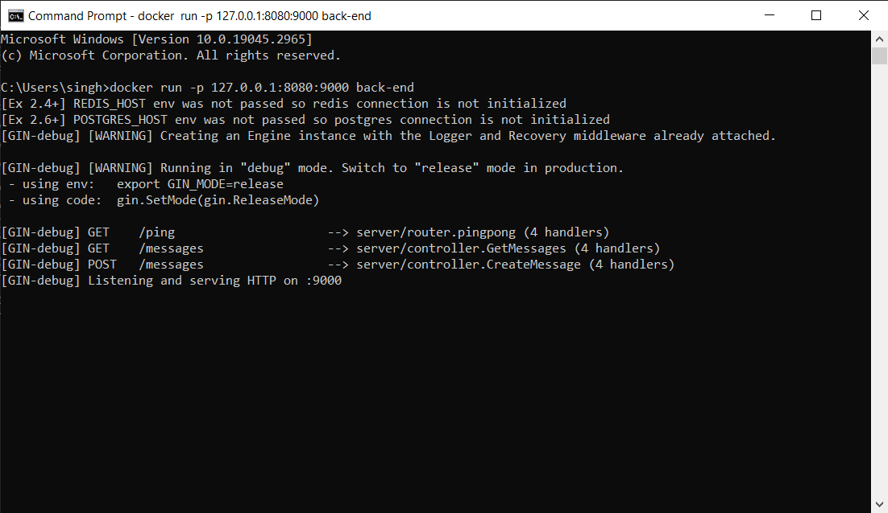

# Dockerfile

```
FROM golang:1.16.15-alpine3.15
WORKDIR /home
COPY example-backend example-backend
WORKDIR /home/example-backend
RUN go build
RUN apk add build-base
RUN go test ./...
ENV PORT=9000
ENV REQUEST_ORIGIN=https://example.com
CMD ./server
```
# Command Used
```
docker run -p 127.0.0.1:8080:9000 back-end
```

# Output
