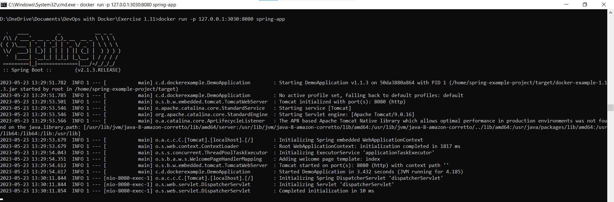
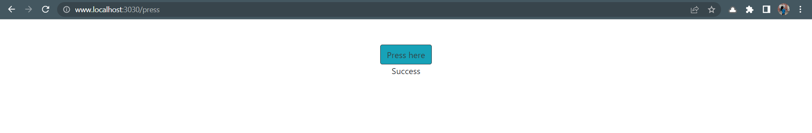

# Dockerfile

```
FROM amazoncorretto:8-alpine-jdk
WORKDIR /home
COPY spring-example-project spring-example-project
WORKDIR /home/spring-example-project
RUN sed -i 's/\r$//' mvnw
RUN ./mvnw package
CMD ["java", "-jar", "./target/docker-example-1.1.3.jar"]
```

# Command to Run

```
docker run -p 127.0.0.1:3030:8080 spring-app
```



# Output


