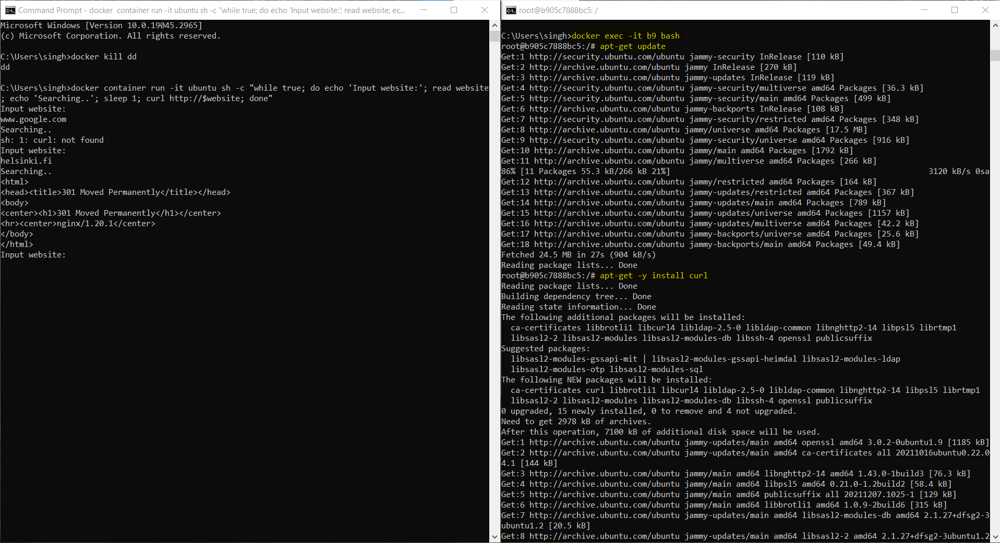

```
docker container run -it ubuntu sh -c "while true; do echo 'Input website:'; read website; echo 'Searching..'; sleep 1; curl http://$website; done"
```

Enter the Website Name, which failed because of _curl not found_

## In a new Command Window

1. docker exec -it 8c bash`
2. `apt-get update`
3. `apt-get -y install curl`

In the Original CMD, type the website name to get the output


